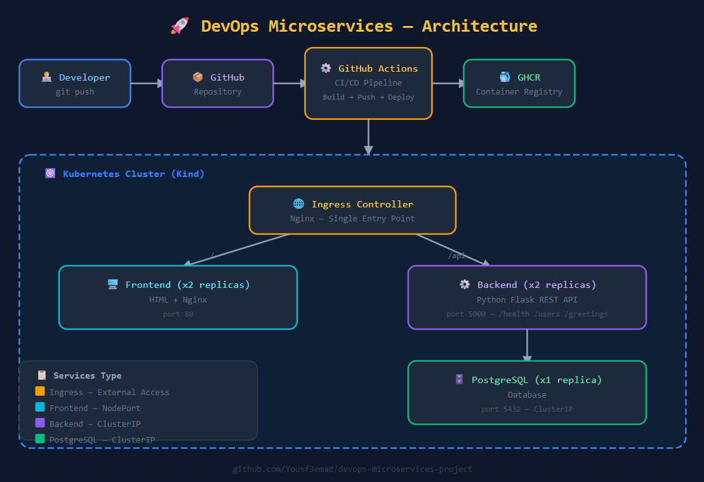
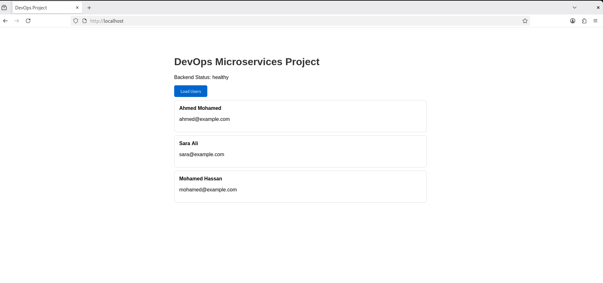

# 🚀 DevOps Microservices Project

A production-ready microservices platform built to demonstrate real-world DevOps practices including containerization, container orchestration, and automated CI/CD pipelines.

---


## 🏗️ Architecture



---


## 📸 Screenshots


---

## 🛠️ Tech Stack

| Category | Technology |
|----------|-----------|
| Containerization | Docker |
| Container Orchestration | Kubernetes (Kind) |
| CI/CD | GitHub Actions |
| Container Registry | GitHub Container Registry (GHCR) |
| Ingress Controller | Nginx |
| Backend | Python Flask |
| Frontend | HTML, CSS, JavaScript |
| Database | PostgreSQL |
| OS | CentOS Stream 9 |
| Version Control | Git & GitHub |


---

## 🔄 CI/CD Pipeline

The pipeline triggers automatically on push to `master` or `feature/eid-greetings-platform` branches:
1. Checkout code
2. Login to GitHub Container Registry
3. Build Docker images (Backend + Frontend)
4. Push images to GHCR with commit SHA tag
5. Update K8s manifests with new image tags
6. Commit and push updated manifests

---

## 🌿 Branch Strategy

main      → Initial project structure
master    → Stable production code (Users Platform)
feature/eid-greetings-platform → Eid Al-Adha Greetings Platform

Each branch has its own CI/CD pipeline trigger and builds independent Docker images tagged with the branch name and commit SHA.

---

## 📡 API Endpoints

| Endpoint | Method | Description |
|----------|--------|-------------|
| `/api/health` | GET | Backend health check |
| `/api/users` | GET | Get all users |
| `/api/greetings` | GET | Get all greetings |
| `/api/greetings` | POST | Add new greeting |
| `/api/greetings/:id` | DELETE | Delete greeting |

---

## 🚀 Local Setup

### Prerequisites
```bash
docker --version    # Docker 29.5+
kubectl version     # kubectl v1.36+
kind version        # Kind v0.27+
aws --version       # AWS CLI v2+
git --version       # Git 2.52+
```

### 1. Clone the Repository
```bash
git clone https://github.com/Yousf3emad/devops-microservices-project.git
cd devops-microservices-project
```

### 2. Create the Kind Cluster
```bash
kind create cluster --config kind-cluster.yaml
```

### 3. Install Nginx Ingress Controller
```bash
kubectl apply -f https://raw.githubusercontent.com/kubernetes/ingress-nginx/main/deploy/static/provider/kind/deploy.yaml

kubectl wait --namespace ingress-nginx \
  --for=condition=ready pod \
  --selector=app.kubernetes.io/component=controller \
  --timeout=120s
```

### 4. Build and Load Docker Images
```bash
docker build -t devops-backend:latest ./backend
docker build -t devops-frontend:latest ./frontend

kind load docker-image devops-backend:latest --name devops-cluster
kind load docker-image devops-frontend:latest --name devops-cluster
```

### 5. Deploy to Kubernetes
```bash
kubectl apply -f k8s/namespace.yaml
kubectl apply -f k8s/postgres.yaml
kubectl apply -f k8s/backend.yaml
kubectl apply -f k8s/frontend.yaml
kubectl apply -f k8s/ingress.yaml
```

### 6. Verify Deployment
```bash
kubectl get all -n devops-microsservices-project
```

### 7. Access the Application

http://localhost        → Users Platform (master branch)
http://localhost        → Eid Greetings Platform (eid branch)


---

## 🔑 Key DevOps Concepts Demonstrated

- **Containerization** — Dockerized microservices with optimized images (slim/alpine)
- **Container Orchestration** — Kubernetes deployments with health probes and resource limits
- **High Availability** — Multiple replicas for zero-downtime deployments
- **CI/CD Automation** — Fully automated build, push, and deploy pipeline
- **GitOps** — K8s manifests updated automatically by CI/CD
- **Ingress Routing** — Single entry point with path-based routing
- **Multi-environment** — Separate deployments per branch
- **Self-healing** — Kubernetes restarts failed pods automatically

---

## 📈 What's Next

- [ ] Terraform — Infrastructure as Code for AWS
- [ ] Ansible — Configuration Management
- [ ] Prometheus & Grafana — Monitoring & Alerting
- [ ] Helm Charts — K8s package management
- [ ] AWS EKS — Production cloud deployment
- [ ] SSL/TLS — HTTPS with cert-manager

---

## 👨‍💻 Author

**Youssef Emad**
Junior DevOps Engineer

[](https://linkedin.com/in/youssef-emad-a16b18214/)

---

> *"Automate everything, monitor everything, and always be ready to roll back."*
